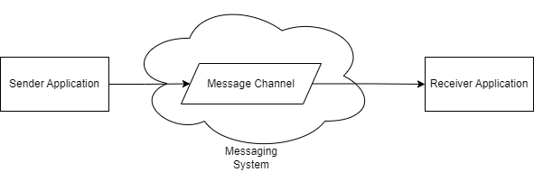

# Message Channel

A message channel connects applications where one application writes information to the channel and another one reads that information from the channel.

When an application wants to communicate, it sends the information to a particular message channel. Another application then retrieves that information from the same message channel.

