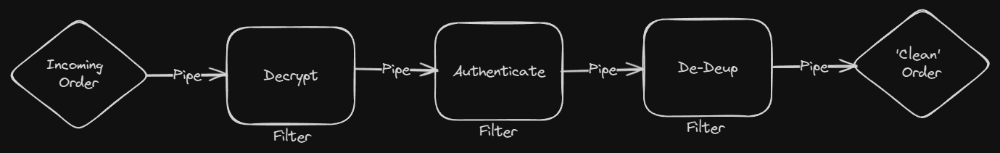

# Pipes and Filters

Pipes and filters are the basis where others integration patterns build upon, it allow us to create smaller, well-defined components that can be reuse in other processes.

The Pipes and Filters architetural style devide a larger processing task into a sequence of smaller, independent processing steps(Filters) that are connected by channels(Pipes).

Let's say we have an order system that needs to descrypt the messages, then authenticate that the order was created by an authorized user and finally make sure that we are not handling duplicate messages. It could look like this:

Filters recieve messages from each pipe through a very simple interface, process the message and then publish the results to another pipe where another filter could pick up the results and do more process on the message. The pipes connect one filter to the next.

Pipes ad filters describe a fundamental architectural style for messaging systems: individual processing steps("filters") are chained together through the messaging channels("pipes").

